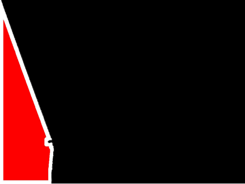
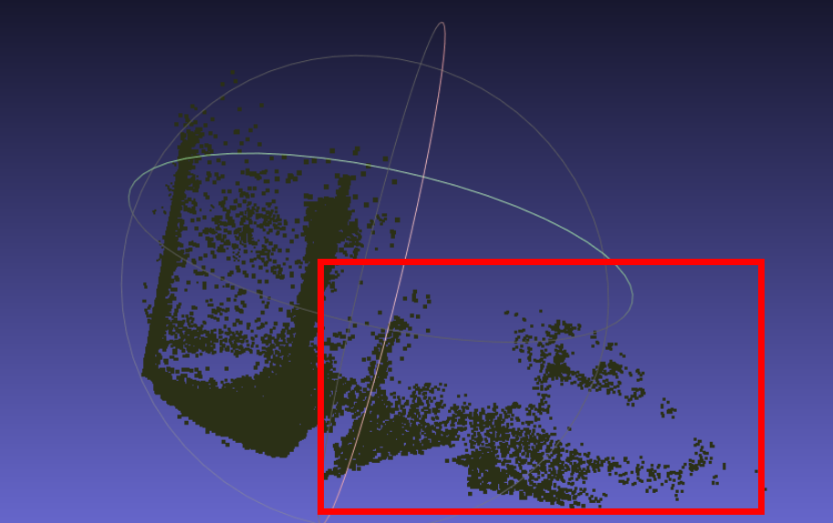
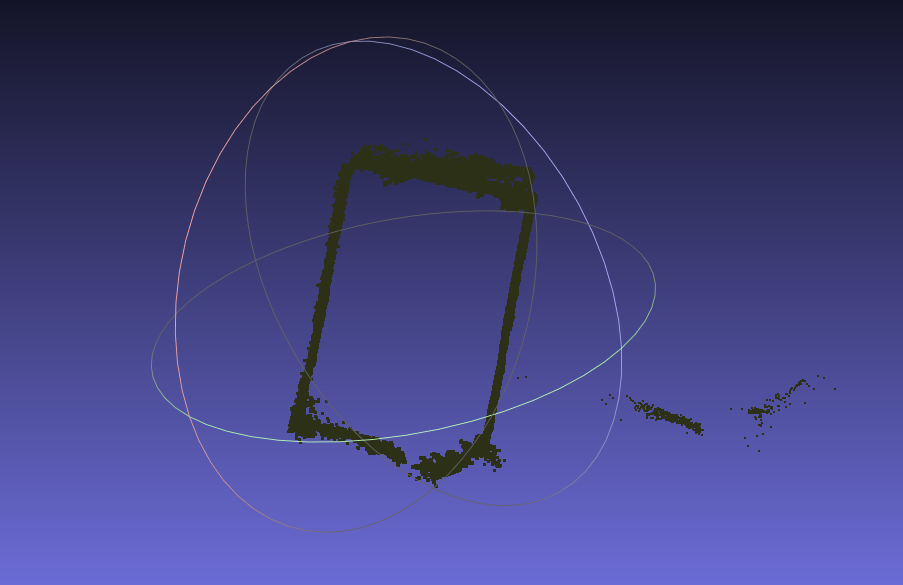

# Mirror-3DGS-my
An unofficial implement of paper Mirror-3DGS: Incorporating Mirror Reflections  into 3D Gaussian Splatting, but with improvement

---

This project is built upon two works: "MirrorGaussian: Reflecting 3D Gaussians for Reconstructing Mirror Reflections" and "Mirror-3DGS: Incorporating Mirror Reflections into 3D Gaussian Splatting." Although these two works have not been open-sourced, this project has been greatly inspired by the ideas expressed in their papers, and I would like to express my gratitude. In addition, there is also an unofficial implementation of the Mirror 3D Gaussian Splatting on 3DGS, which can be found in the 2DGS repository at https://github.com/TingtingLiao/MirrorGS. I have also gained a lot of inspiration from this repository while working on this project, and I am very thankful.

| Scene            | Coffee-House    | Meeting-Room   | Market       | Lounge       |
|------------------|-----------------|----------------|--------------|--------------|
| **Metrics**      | PSNR  | PSNR  | PSNR  | PSNR  | PSNR  | PSNR  | PSNR  | PSNR  |
| MS-NeRF          | 26.21 | 31.09 | 26.25 | 31.20 | 31.10 |
| Mirror-NeRF      | 23.92 | 27.43 | 27.49 | 29.38 | 29.38 |
| Ref-NeRF         | 23.82 | 27.48 | 28.01 | 29.53 | 29.53 |
| Vanilla 3DGS     | 25.83 | 28.82 | 28.29 | 30.11 | 30.11 |
| MirrorGaussian | 26.66 | 30.63 | 28.35 | 31.10 | 31.10 |
| **my-MirrorGS** | - | - | 34.29(full)   /  27.27(mirror only) | 34.25(full)  /    23.75(mirror only) | 31.10 |

We know that in scenes with planar mirrors, in order for the GS to make accurate predictions, it is crucial to correctly estimate the position of the mirror, i.e., the mirror equation. However, in current estimation methods, most of the constraints are applied to the depth, and then the RANSAC algorithm is used to extract suitable mirror points to form the plane. The idea of this project is to explore whether it is possible to estimate the mirror without using depth constraints, instead using Gaussian points on the mirror border. Therefore, the key issue becomes how to distinguish between the mirror border and the mirror interior Gaussian points. In other words, how to apply a reasonable denoising algorithm during the plane estimation process to remove non-mirror points becomes critical.

The core point, in combination with previous work, is to hollow out the interior of the mirror. Therefore, in this project, the mirror mask results are preprocessed, and the two types of GS are directly distinguished using color. At the same time, the mirror attribute is transformed into a three-dimensional data for prediction.

Compared to the previous method, this approach can predict two parts of the Gaussian points: one part represents the boundary, and the other part represents the interior of the mirror.

This is the mirror point cloud obtained from the previous method.

This is the mirror point cloud obtained using the mirror distinction strategy.

In this way, we obtain the mirror point cloud representing the boundary. By applying some denoising algorithms and least squares fitting, we can directly fit a more accurate mirror plane. Through subsequent plane optimization, we can essentially achieve a very accurate plane position.

I hope this open-source project can help those in need.